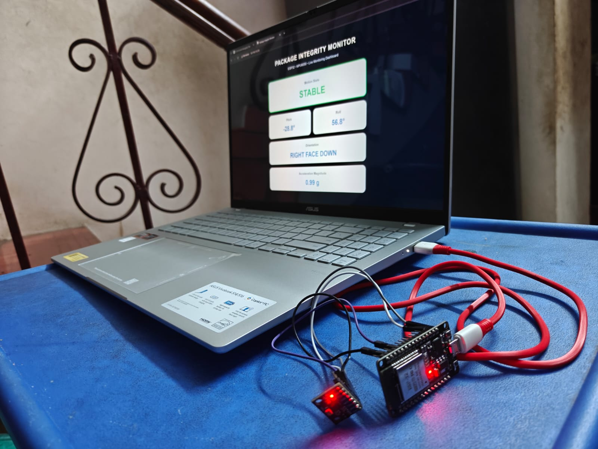

# Package Integrity Monitor

A real-time package integrity monitoring system built using an **ESP32** and **MPU6050** accelerometer/gyroscope sensor.

The system monitors acceleration and orientation and classifies the package state as **STABLE**, **IN TRANSIT**, **IMPACT**, or **FALL**. A live web dashboard hosted by the ESP32 displays the sensor readings over Wi-Fi.

## Features

* Real-time acceleration magnitude monitoring
* Pitch and roll measurement
* Package orientation detection
* Motion-state classification
* Fall detection using a free-fall condition followed by an impact
* Impact detection without preceding free fall
* Live web dashboard hosted directly on the ESP32
* Wireless monitoring through the ESP32's Wi-Fi network

## Hardware

* ESP32 development board
* MPU6050 sensor module
* USB cable
* Jumper wires
* Laptop

## How It Works

The MPU6050 provides acceleration measurements along the X, Y, and Z axes. These values are converted into acceleration in units of **g** and combined to obtain the overall acceleration magnitude.

The system uses this magnitude to identify different motion conditions:

| Condition                                             | Classification |
| ----------------------------------------------------- | -------------- |
| Acceleration close to 1 g                             | STABLE         |
| Normal movement                                       | IN TRANSIT     |
| Sudden acceleration spike without preceding free fall | IMPACT         |
| Low acceleration followed by an impact                | FALL           |

For fall detection, the system first detects a low-acceleration state indicating possible free fall. If a sufficiently large acceleration spike occurs within the defined fall window, the event is classified as a FALL.

## Dashboard

### Stable State

### In Transit

### Impact Detection

### Fall Detection

## Hardware Setup

## Technology Used

* ESP32
* MPU6050
* Arduino C++
* I2C communication
* Wi-Fi
* Embedded web server
* HTML
* CSS
* JavaScript
* JSON

## Project Outcome

The prototype successfully demonstrates real-time monitoring of package motion and orientation, along with detection of impact and fall events using an inertial measurement sensor.

## Future Improvements

* Add data logging for historical events
* Add a buzzer or LED for physical alerts
* Improve event classification using gyroscope data
* Add wireless/cloud-based remote monitoring
